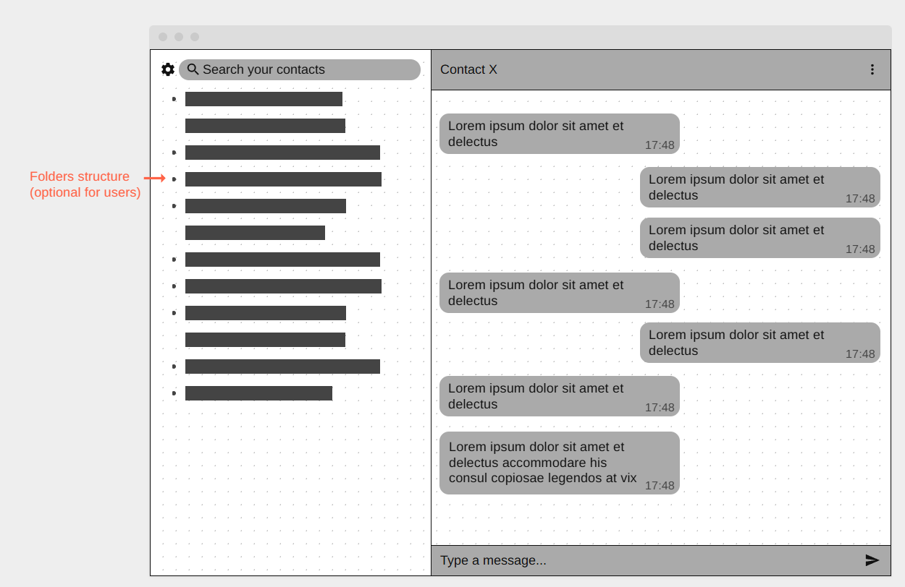

# Boris's Chatting App Implementation

## My Approach

This is my personal implementation of the chatting application project. I'll be focusing on creating a clean, intuitive interface with smooth user experience. The messages will be directly sent from browser to browser, without any backend intervention, laying the grounds for a later enforcement of cibersecurity.

## Design Philosophy

- **Minimalist UI**: Clean and simple interface that focuses on the conversation
- **User-Friendly**: Intuitive interactions and clear visual feedback
- **Performance**: Efficient DOM manipulation and optimized local storage usage
- **Accessibility**: Semantic HTML and keyboard navigation support
- **Direct messaging:** Messages are directly sent from browser to browser
- **Mobile and Desktop:** Aim to work on both platforms

## Technical Approach

### Architecture

- Modular JavaScript structure with separate files for different concerns
- Progressive enhancement for better compatibility

### Key Features I'll Implement

#### Core Features

- [ ] Clean chat interface with message bubbles
- [ ] Real-time message input with enter key support
- [ ] User name persistence
- [ ] Message timestamps
- [ ] Local storage for chat history
- [ ] Basic emoji picker
- [ ] Peer-to-peer messaging (with webRTC)

#### Advanced Features (If time permits)

- [ ] Dark/light theme toggle + Accent color selector
- [ ] Message editing (double-click to edit)
- [ ] Message deletion
- [ ] Chat export functionality
- [ ] Typing indicators simulation
- [ ] Sound notifications
- [ ] Markdown style text editor, with right-click options (using external libraries)
- [ ] Enhanced security and privacy

## Project Structure

```
Boris/
├── index.html          # Main HTML structure
├── css/
│   ├── styles.css      # Main stylesheet
│   ├── themes.css      # Theme variables
│   └── responsive.css  # Media queries
├── js/
│   ├── app.js          # Main application logic
│   ├── chat.js         # Chat functionality
│   ├── storage.js      # Local storage management
│   └── utils.js        # Utility functions
├── assets/
│   ├── docs/           # Documentation images (wireframes, etc.)
│   ├── icons/          # Custom icons
│   └── sounds/         # Notification sounds
└── README.md           # This file
```

## Design Decisions

### Wireframe



*Initial wireframe showing the basic layout, mobile layout would consist on two separate sections based on the desktop version: a contacts section and a messaging section.*

*Might consider adding a tabs top menu, like a browser or file explorer, for the messaging section. Might as well consider adding a quick-switch action to toggle, in the contacts section, between a folders view and a more traditional "recents" view, or maybe even a bookmarks view.*

### Color Scheme

- Primary: *To be decided*
- Message bubbles: Differentiated colors for sent/received
- Emphasis on readability and eye comfort

### Typography

- *Font to be decided*
- Proper font weights for hierarchy
- Optimal font sizes for readability

### Layout

- Fixed header with chat title/controls
- Scrollable message area
- Fixed input area at bottom
- Responsive design for mobile devices

### HTML Structure

The app uses semantic HTML5 elements to create an accessible and well-structured foundation:

- **Two-panel layout**: `<main>` contains two `<section>` elements (contacts and chat) representing distinct functional areas
- **Heading hierarchy**: `<h1>` for app title, `<h2>` for chat partner name, `<h3>` for "landmarks" in the chat (maybe for different days, to be decided)
- **Semantic lists**: `<ul>` for contacts, `<ol>` for chat messages (chronological order)
- **Navigation elements**: `<nav>` wraps action buttons for better accessibility
- **Form semantics**: Message input uses proper `<form>`, `<label>`, and form controls

This structure prioritizes semantic meaning, making the app more accessible and maintainable.

## Learning Goals

- Master CSS Grid and Flexbox for complex layouts
- Implement efficient local storage patterns
- Practice modern JavaScript ES6+ features
- Improve accessibility and semantic HTML skills
- Explore CSS animations and transitions

## Notes and Reflections

**July 21, 2025 - Semantic HTML Foundation**
Completed the initial HTML structure with a focus on semantic elements and accessibility. The two-panel layout uses sections to clearly separate contacts and chat functionality. This foundation will make CSS styling and JavaScript interactions much cleaner to implement, as well as identify the areas that still need work.

*This section will be updated throughout the development process with insights, challenges, and solutions discovered during implementation.*

---

**Started:** July 18, 2025
**Developer:** Boris
**Project:** Weekly-Projects Chatting App
